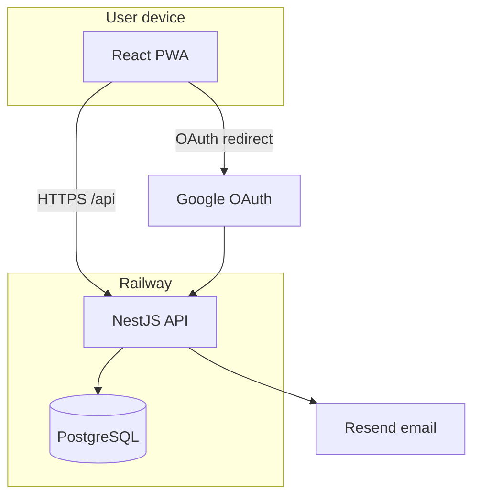
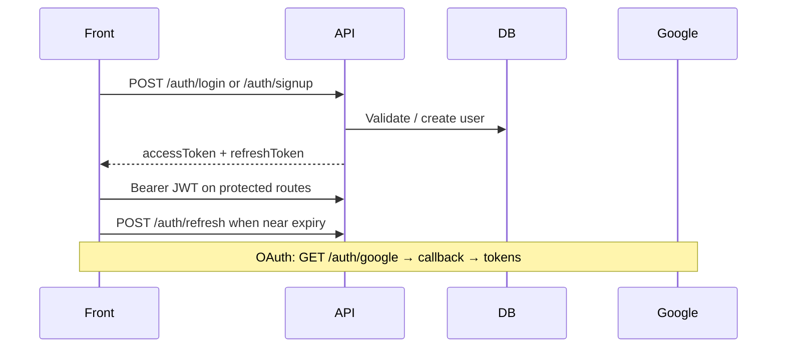

# Gym-log — Architecture

**Status:** Approved for implementation reference  
**Last updated:** 2026-06-18  
**Product source of truth:** [PROJECT_DEFINITION.md](./PROJECT_DEFINITION.md)

This document describes *how* gym-log is built at a high level. Implementation should trace back here and to the product definition (especially §7 and §10).

---

## 1. Purpose

Gym-log is a monorepo PWA: a **NestJS API** persists workout and diary data in **PostgreSQL**; a **React frontend** provides mobile-first UI, talks to the API over HTTP, and can be installed as a PWA. Users authenticate with JWT; all domain rules and persistence live in the API.

---

## 2. Architecture principles

| Principle | Choice |
|-----------|--------|
| **State ownership** | PostgreSQL via NestJS/Prisma; API is the single source of truth |
| **Frontend role** | React renders API data (TanStack React Query); no duplicated domain logic |
| **Folder boundary** | All backend in `api/`; all frontend in `front/`; **no shared code** between them |
| **Communication** | HTTP only (`/api` prefix); front proxies to API in local dev |
| **Secrets** | JWT, Google OAuth, Resend, `DATABASE_URL` — **api only**, never in front bundle |
| **Auth** | JWT access + refresh; Passport guards on protected routes |
| **Deploy** | Railway (API + front); local dev via root `npm run dev:all` |
| **i18n** | Frontend-only (`front/src/locales/{en,pt}/`) |

---

## 3. System context



**Local development:** Browser → Vite (`localhost:5173`) → proxy `/api` → NestJS (`localhost:3000`) → Docker Postgres.

---

## 4. Repository layout and folder boundary

**Rule:** Backend and frontend are fully separated. They communicate **only over HTTP**. No monorepo packages, no shared TypeScript modules, no shared `types/` folder.

```
gym-log/
  api/                  # Everything backend (NestJS)
  front/                # Everything frontend (React + Vite PWA)
  docs/                 # Product + architecture specs
  .github/workflows/    # CI pipelines
  docker-compose.yaml     # Local Postgres + pgAdmin
  package.json            # Root dev orchestration (concurrently, husky)
```

### `api/` — backend only

```
api/
  src/                  # NestJS modules, controllers, services, DTOs
  prisma/               # schema, migrations, seeds
  generated/prisma/     # Prisma client output
  test/                 # E2E tests
  package.json
```

Includes: auth, workouts, templates, statistics, diary, tags, rest timers, email, Prisma access.

### `front/` — frontend only

```
front/
  src/
    pages/              # Route-level screens
    components/         # Shared UI
    api/                # Axios API clients (fetch wrappers)
    auth/               # AuthContext, route guards
    locales/            # i18n JSON (en, pt)
    hooks/              # Custom hooks
    lib/                # Axios instance, refresh client
  public/               # PWA manifest, icons
  package.json
```

API response types are defined **inside front** (e.g. `front/src/api/*.ts`) — not imported from `api/`.

### Allowed outside `api/` and `front/`

| Path | Role |
|------|------|
| **docs/** | Product and architecture documentation |
| **docker-compose.yaml** | Local Postgres for development |
| **package.json** (root) | `dev`, `dev:all`, husky pre-commit |

### Not allowed

- `packages/` or any shared library imported by both apps
- Cross-imports between `api/` and `front/`
- Business logic in root scripts (orchestration only)

| App | Responsibility |
|-----|----------------|
| **api/** | Persistence, validation, auth, statistics, email, all domain rules |
| **front/** | Routes, UI, PWA, API client, local UI state, i18n |

**Stack:** TypeScript in both apps (separate `package.json` each). NestJS 11, Prisma 6, PostgreSQL 16, React 19, Vite 7, Tailwind CSS, TanStack React Query.

---

## 5. API module structure

Modules registered in `api/src/app.module.ts`:

| Module | Path prefix | Responsibility |
|--------|-------------|----------------|
| **AuthModule** | `/auth` | Signup, confirm, login, refresh, Google OAuth, password reset |
| **UserModule** | `/users` | Profile stats (height, weight, name) |
| **ExerciseModule** | `/exercises` | Global and user exercises CRUD |
| **WorkoutTemplateModule** | `/workout-templates` | Template CRUD (owner-scoped) |
| **WorkoutSessionModule** | `/workouts` | Session lifecycle, sets, exercises, finish |
| **StatisticsModule** | `/statistics` | Dashboard, evolution, progression, export, pinned exercises |
| **BodyMeasurementModule** | `/body-measurements` | Measurements CRUD + stats |
| **SleepModule** | `/sleep` | Sleep CRUD + stats |
| **RestTimerModule** | `/rest-timers` | Custom rest timers |
| **WorkoutTagModule** | `/tags` | User tag CRUD |
| **EmailModule** | — | Internal Resend service |
| **AppConfigModule** | — | DB-backed config (e.g. password reset TTL) |
| **PrismaModule** | — | Shared database access |

**Shared infrastructure** (`api/src/common/`):

- `filters/` — global HTTP and Prisma exception filters
- `guards/` — roles guard (ADMIN)
- `decorators/` — `@CurrentUser()`, `@Roles()`
- `dto/` — pagination, session tags

**Bootstrap** (`api/src/main.ts`): global prefix `api`, ValidationPipe, CORS from `FRONTEND_URL`, Swagger at `/docs` (non-production only), Throttler (200 req/min).

---

## 6. Key API surface (sketch)

All routes prefixed with `/api`. Exact DTOs in Swagger (local) or controller files.

**Auth** — `POST /auth/signup`, `confirm-signup`, `login`, `refresh`, `forgot-password`, `reset-password`; `GET /auth/google`, `google/callback`, `validate`

**Users** — `GET|PUT /users/stats`

**Exercises** — `GET|POST /exercises`, `GET|PUT|DELETE /exercises/:id`

**Templates** — `GET|POST /workout-templates`, `GET|PUT|DELETE /workout-templates/:id`

**Workouts** — `POST /workouts/free/start`, `POST /workouts/start/:templateId`, `POST /workouts/copy/:sessionId`, `GET /workouts/active`, `GET|PATCH|DELETE /workouts/:id`, exercise/set CRUD, `POST /workouts/:sessionId/finish`

**Statistics** — `GET /statistics/workouts`, `evolution`, `exercise/:id/progression`, `exercise/:id/history`, pinned exercises, `workouts/export`

**Diary** — `GET|POST /body-measurements`, `latest`, `check-today`, `stats`; same pattern for `/sleep`

**Tags** — `GET|POST /tags`, `PATCH|DELETE /tags/:id`

**Timers** — `GET|POST /rest-timers`, `PATCH|DELETE /rest-timers/:id`

---

## 7. Active workout model

- **One active session per user:** `GET /workouts/active` returns the in-progress session or null
- **Lifecycle** owned by `WorkoutSessionService`: start → add exercises/sets → finish (`endAt`, fatigue, feeling) or delete
- **Frontend:** navigates to `/app/workouts/:id` for active logging; read-only view at `/app/workouts/:id/view` when finished
- **Copy session:** duplicates structure and planned fields from a finished session into a new active session

---

## 8. Frontend architecture

**Router:** `front/src/main.tsx` — react-router-dom v7 with public routes (`/login`, `/signup`, …) and protected `/app/*` under `AppLayout`.

**Data layer:** TanStack React Query with 5-minute stale time; API calls via `front/src/lib/api.ts` (Axios + JWT refresh queue).

**Auth:** `AuthContext` stores user/token; `ProtectedRoute` / `ProtectedRouteWithStats` gate routes; proactive token refresh before expiry.

**Layout:** `AppLayout` — navbar, mobile bottom navigation, floating action button for start workout.

**PWA:** vite-plugin-pwa — standalone display, service worker, install prompts.

---

## 9. Data and retention

### Entity model (Prisma)

| Entity | Notes |
|--------|-------|
| **User** | Auth, profile, `pinnedExerciseIds`, role USER/ADMIN |
| **Exercise** | Global or user-created; unique name |
| **WorkoutTemplate** → **TemplateExercise** → **TemplateSet** | Owner-scoped plans |
| **WorkoutSession** → **SessionExercise** → **SessionSet** → **SessionSetIntensityBlock** | Active when `endAt` is null |
| **WorkoutTag** / **WorkoutSessionTag** | Many-to-many tags on sessions |
| **RestTimer** | Per-user durations |
| **BodyMeasurement**, **Sleep** | Diary entries |
| **PasswordResetToken**, **EmailVerificationToken** | Auth flows |
| **AppConfig** | Key-value server config |

**Scoping:** All user data queries filter by authenticated `userId`. Templates and sessions are owner-scoped. Global exercises readable by all; mutations require admin or creator.

**Cascade:** Deleting a session cascades exercises, sets, and tag links. Deleting a user cascades owned entities per schema relations.

---

## 10. Authentication flow



Passwords hashed with bcrypt. Email signup requires confirmation token before login.

---

## 11. Deployment and CI

**Production:** Railway deploys `api/` and `front/` from `master` (separate services). Environment variables set per service (`DATABASE_URL`, `JWT_SECRET`, `FRONTEND_URL`, etc.).

**CI** (`.github/workflows/ci.yml`):

| Job | Validates |
|-----|-----------|
| `api` | Prisma validate, lint, build, unit tests, migrations, e2e (Postgres) |
| `front` | lint, build |
| `security-audit` | npm audit (high/critical) |
| `secrets-scan` | Gitleaks |
| `CodeQL` | Static security analysis |
| `dependency-review` | Vulnerable deps on PRs |

**Pre-commit:** Husky runs ESLint on staged `api/**/*.ts` and `front/**/*.{ts,tsx}`.

---

## 12. Testing architecture

| Type | Location | Status |
|------|----------|--------|
| **Unit (API)** | `api/src/**/*.spec.ts` | 13 spec files; strongest coverage in `workout-session` and `workout-tag` services |
| **E2E (API)** | `api/test/app.e2e-spec.ts` | Minimal (health-style stub) |
| **Frontend** | — | No test runner configured |

**Patterns:** Mock Prisma in service tests; use NestJS testing module for controllers. External I/O (email, OAuth) should be mocked in tests.

See `.cursor/rules/quality-gate.mdc` for TDD expectations on new behavior.

---

## 13. Statistics and progression

- **Weekly volume / sets:** aggregated in `StatisticsService` by muscle group and date range
- **Exercise progression:** history and charts per exercise; Epley formula in `one-rep-max.util.ts` for estimated 1RM
- **Pinned exercises:** stored on `User.pinnedExerciseIds`; quick access from progress UI
- **Export:** workout history export endpoint consumed by front (`html2canvas` for PNG)
- **Known gap:** home dashboard `recentPRs` is stubbed — real PR comparison against history not yet implemented (`statistics.service.ts` TODO)

---

## 14. Open decisions and known gaps

| Topic | Notes |
|-------|-------|
| Dashboard recent PRs | Stub returns empty; needs historical comparison |
| Health endpoint | Not implemented; useful for Railway health checks |
| Frontend tests | Vitest not set up |
| E2E coverage | Expand beyond `GET /api` smoke test |
| Structured logging | Console/logger only today |
| Env validation | No boot-time schema for env vars |

---

## 15. Related documents

| Document | Purpose |
|----------|---------|
| [PROJECT_DEFINITION.md](./PROJECT_DEFINITION.md) | Product scope and locked decisions |
| [README.md](../README.md) | Local dev, seeds, CI summary |
| `.cursor/rules/architecture.mdc` | Concise boundary rules for agents |
| `.cursor/rules/quality-gate.mdc` | TDD and Definition of Done for agents |

---

## Document history

| Date | Change |
|------|--------|
| 2026-06-18 | Initial architecture document (v0.16.0) |
