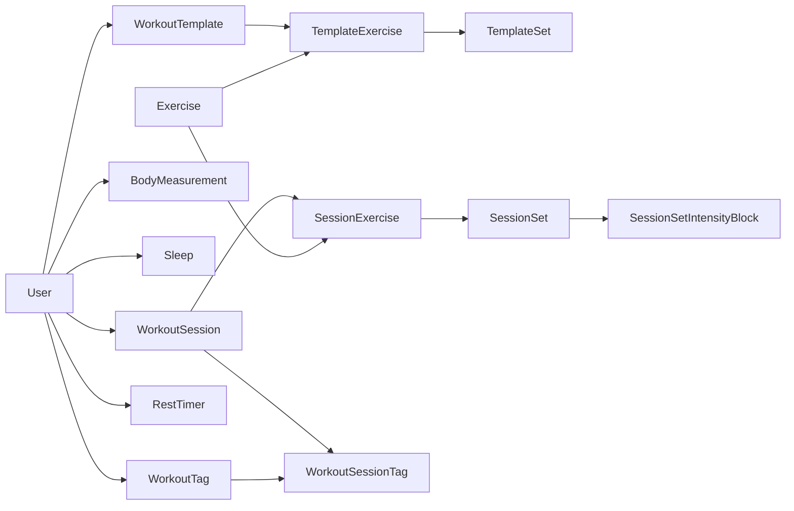

# Gym-log — Project Definition

**Status:** Approved (reflects shipped product v0.16.0)  
**Last updated:** 2026-06-18  
**Document type:** Product definition (not technical implementation)

This document describes what gym-log is, who it serves, how it behaves, and what is in scope. Technical design should trace back to sections here—especially [§10 Locked product decisions](#10-locked-product-decisions).

---

## 1. Executive summary

**Gym-log** is a personal workout and body-tracking progressive web app (PWA). Users log gym sessions in real time—sets, load, reps, RIR, and advanced intensity techniques—review progress over time, and keep a diary of body measurements and sleep. Workouts can start from scratch, from reusable templates, or by copying a past session.

Unlike generic fitness apps focused on social feeds or coach-led programs, gym-log targets **self-directed lifters** who want structured logging, honest progression data, and a lightweight diary—all in a mobile-first PWA installable on their phone.

---

## 2. Problem and opportunity

| Spreadsheets / notes | Generic fitness apps | Gym-log |
|---|---|---|
| Manual, error-prone | Social features, ads, bloat | Focused logging and analytics |
| No templates or RIR | Limited intensity techniques | Templates, planned vs actual, rest-pause / drop / cluster |
| Progress scattered | Measurements often separate | Workouts + diary in one app |

**Opportunity:** Lifters who care about progressive overload and body composition want a fast in-gym experience and clear charts afterward—without managing a spreadsheet or paying for coaching features they do not use.

---

## 3. Vision and positioning

**One-liner:** *"Log every set, see your progress, track your body—all in one PWA."*

**Positioning:** Mobile-first, bilingual (English and Portuguese), privacy-respecting personal training log. Installable PWA for gym-floor use; desktop-friendly for planning templates and reviewing charts.

---

## 4. Target users

### Primary: Individual lifter / athlete

- Logs workouts at the gym on phone
- Uses templates for recurring programs
- Reviews weekly volume, exercise progression, and PRs
- Tracks weight, waist, arm, and sleep over time

### Secondary: Admin

- Manages **global exercises** available to all users
- Receives email notification when new users sign up (optional)

### Out of scope

- Coaches managing multiple athletes
- Social feeds, sharing workouts publicly
- Marketplace, paid programs, or in-app coaching
- Offline-first sync (online API required)

---

## 5. Core concepts (domain model)

### User

Account with email/password or Google OAuth. Profile includes name, height, and weight (required after signup for onboarding). Can pin favorite exercises for quick access on the progress page.

### Exercise

Named movement with optional muscle group. **Global** exercises are admin-managed and visible to everyone; **user-created** exercises belong to the creator. Names are unique across the system.

### WorkoutTemplate

Reusable workout plan owned by a user: title, notes, ordered exercises, and per-exercise template sets (reps, RIR). Starting from a template pre-fills **planned** reps/RIR on session sets.

### WorkoutSession

A single gym visit. Either **active** (`endAt` null) or **finished** (`endAt` set, with optional fatigue, feeling, duration, notes). Started free, from a template, or by copying a finished session. At most **one active session per user**.

### SessionSet

Logged set with planned and actual load, reps, RIR, completion flag, and optional intensity type:

- **REST_PAUSE** — extra reps after a short rest (intensity blocks)
- **DROP_SET** — reduced load continuation
- **CLUSTER_SET** — clustered reps with rest between clusters

### WorkoutTag

User-defined labels (e.g. "Push", "Deload") attachable when starting or finishing a workout. History can be filtered by tag.

### RestTimer

Per-user rest countdown durations (defaults plus custom timers) used during active sessions.

### BodyMeasurement

Dated entry: weight (required), optional waist and arm, notes.

### Sleep

Dated entry: hours slept, optional quality score, bedtime/wake times, notes.

---

## 6. Primary user flows

### Auth and onboarding

1. Sign up with email → confirm via email link → log in  
   **Or:** sign in with Google OAuth  
2. If height/weight not set → **onboarding** (`/app/stats`) → home dashboard

### Log a workout

1. Tap **Start workout** (FAB or bottom nav)  
2. If an active session exists → resume it  
3. Otherwise choose: **free**, **from template**, or **copy past session**; optionally pick tags  
4. Active session UI (`/app/workouts/:id`): add exercises, log sets (planned vs actual), use rest timers, view exercise history  
5. **Finish** → fatigue, feeling, notes, tags → return to history

### Review progress

1. **Progress overview** — weekly volume and sets by muscle group, date range filter, export workout history  
2. **Exercise progression** — per-exercise charts, pin favorites  
3. **Body weight trend** — from body measurements

### Diary

1. **Measurements** — list, charts, add/edit entries  
2. **Sleep** — list, stats, add/edit entries

### Manage library (secondary navigation)

- Exercises (list, create, edit)  
- Workout templates (list, create, edit)  
- Workout tags (manage labels)

---

## 7. Functional requirements

### Must have (shipped)

- Email signup with confirmation, login, password reset, Google OAuth
- JWT auth with token refresh
- Onboarding gate for height/weight
- Workout lifecycle: free start, template start, copy session, active logging, finish, history, delete
- Planned vs actual sets when using templates
- Intensity techniques: rest-pause, drop set, cluster (with intensity blocks)
- Workout tags: create, rename, delete, assign, filter history
- Rest timers during active workout
- Exercises: global + user-owned, muscle groups, CRUD with ownership rules
- Workout templates: CRUD, owner-scoped
- Progress: dashboard stats, weekly volume/sets, exercise progression, pinned exercises, export
- Diary: body measurements and sleep with stats and charts
- i18n: English and Portuguese
- PWA installability

### Should have (backlog)

- Real **recent PRs** on home dashboard (currently stubbed in statistics service)
- `/health` endpoint for deployment checks
- Broader API unit test coverage and meaningful e2e tests
- Frontend test infrastructure (Vitest)
- Structured logging and env validation at API boot

### Won't have (current scope)

- Social features or public workout sharing
- Coach / multi-athlete management
- Offline sync or local-only mode
- Native mobile apps (PWA only)
- Print or PDF workout plans

---

## 8. Non-functional requirements

| Area | Target |
|---|---|
| **Platform** | PWA (mobile-first), modern browsers |
| **Auth** | JWT (7-day access), refresh endpoint, bcrypt passwords |
| **API** | NestJS, global validation, rate limiting (200 req/min), Swagger in local dev |
| **Data** | PostgreSQL via Prisma; user-scoped queries |
| **Deploy** | Railway auto-deploy on `master`; Node.js 24 |
| **CI** | GitHub Actions: API lint/build/test/e2e; front lint/build; security scans |
| **i18n** | All new user-facing strings in `en` and `pt` |

---

## 9. Privacy and data handling

- **User-owned data:** workouts, templates, measurements, and sleep belong to the authenticated user
- **Secrets server-only:** JWT secret, database URL, Google OAuth credentials, Resend API key—never in the frontend bundle
- **Email:** transactional only (signup confirmation, password reset, optional admin new-user notification) via Resend
- **No third-party analytics** required for core product (deployment platform may collect infra metrics)

---

## 10. Locked product decisions

| Decision | Choice |
|---|---|
| **Active sessions** | One active workout per user at a time |
| **Start modes** | Free, template, or copy past session |
| **Planned vs actual** | Template starts pre-fill planned reps/RIR; user logs actuals |
| **Intensity types** | NONE, REST_PAUSE, DROP_SET, CLUSTER_SET with intensity blocks |
| **Exercise scope** | Global (admin) + user-created; unique names |
| **Tags** | User-scoped; normalized names; filterable history |
| **i18n** | English + Portuguese for all user-facing copy |
| **API prefix** | `/api`; frontend proxies `/api` in local dev |
| **Auth** | Email + Google OAuth; JWT bearer tokens |
| **Units** | Load in KG or LB per set |

---

## 11. Success metrics

- **Session completion:** % of started workouts that are finished (not abandoned)
- **Retention:** users logging at least one workout per week
- **Diary adoption:** % of active users with at least one measurement or sleep entry per month
- **Qualitative:** users report faster logging than spreadsheets; progression charts match expectations

---

## 12. Related documents

| Document | Purpose |
|---|---|
| [ARCHITECTURE.md](./ARCHITECTURE.md) | Technical architecture, repo layout, API modules |
| [README.md](../README.md) | Local development, CI, seeds |
| Swagger (`/docs`, local only) | Runtime API reference |

Technical architecture and implementation tasks are **out of scope** for this file; they should reference §7 and §10.

---

## Document history

| Date | Change |
|---|---|
| 2026-06-18 | Initial project definition (v0.16.0 scope) |
